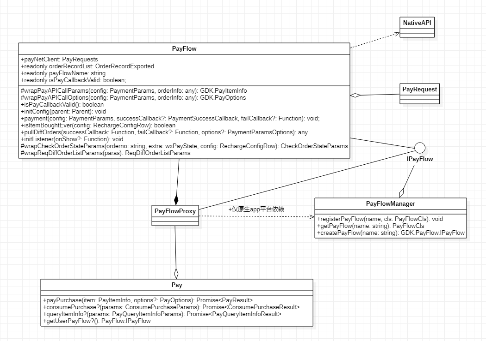

## 1.支付接入流程

支付需要插件内提供实现 `IPay` 接口的支付模块。
如果需要定制修改该渠道特有的一些参数、服务器接口等，那么需要在 getUserPayFlow 接口实现中，返回自定义的 PayFlow。自定义PayFlow可以参考其他渠道目录下的 pay 文件夹下的 PayFlow 定义，它们通过重载 PayFlow 的方法和成员来定制支付流程。PayFlow 各个对象关系如下，其中：

- 可以通过重载形如 "**wrap...Params**" 的方法来实现自定义支付相关参数。
- PayFlowProxy 复杂选择需要使用的 PayFlow，通过 PayFlowProxy 实现多渠道支付流程选择。
- 特别的 ，对于 app 平台，则是通过在 `src\lpluginshare\appshare\pay` 中实现自定义的 PayFlow 并调用 PayFlowManager 注册来更方便地实现其他原生支付平台的支付流程；之后在 PayFlowProxy  的 `payWay2PayFlowMap` 中指定`自定义PayFlow`和 `PayWay` 之间的对应关系。

